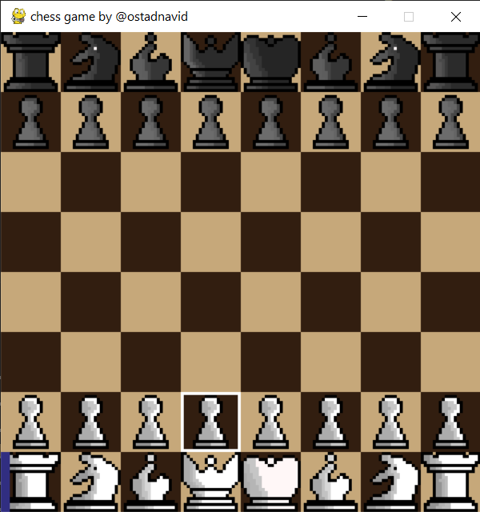

# chess python

## info

this is chess game written in python.
the main game is written in 2d array, and i used pygame to make graphics.

## files
- gamegraphics.py : the game with graphics
- gamenographics.py : shows have to use game.py to play chess without graphics
- piece.py : objects about pieces, used in player.py
- player.py : object about the white and black, used in game.py 
- game.py : the core game (2d array implementation)

## screen shots

## notes

currently there are some bugs in piece rules, and i have'nt implemented the game ending.

